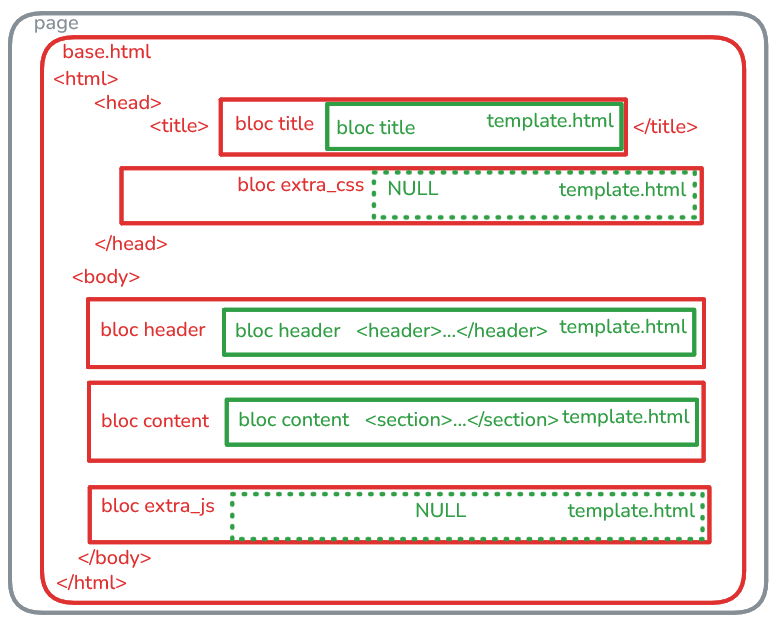

# usage simple du MVT

## création d'un 1er modèle Client:

1. **classe Client** dans `./models.py`
2. **migration**: mettre en cohérence la représentation en logique serveur (modeèles django) et la base de données (tables)
  - `uv run python manage.py makemigrations` => crée un fichier de migration dans le dossier `./migrations` de l'application
  - `uv run python manage.py migrate` => applique les migrations à la base de données

## afficher le premier client dans la page d'accueil

3. **données**: insérer un client en bdd: `INSERT INTO client_client (firstname, lastname, email, mobile) VALUES ('jean', 'Dupont', 'jdupont@example.com', '0904567824')`
   - describe avec sqlite: `PRAGMA table_info(client_client)`
   - REM avec sqlit: dans query le <backspace> permet de voir les commandes précéentes

4. utiliser un client dans une **vue**: `./views.py`
   - chercher des objet métier en requêtant sur la bdd avec `Client.objects.<method>()`:  *.get(), .filter(), .all(), .first(), .last() ...*
   - injecter les objets métiers dans le **contexte de la vue** en *affichage dans le template* avec `render(request, 'template.html', context={...})`

5. injecter le contexte dans un **template**: `./templates/home.html`
   - utiliser les variables du contexte avec la syntaxe `{{ variable }}`
   - utiliser les structures de contrôle avec la syntaxe ` ... ` et ` ... ` pour dynamiser l'affichage

```html
<p class="lead text-white-50 mb-4">
    <strong> ??? </strong><br>
    Email: ??? <br>
    Mobile: ???
</p>
```

## différencier le template de la vue et le layout de l'application

6. créer un fichier **layout** `./templates/base.html` pour factoriser le squelette HTML commun à toutes les pages de l'application (header, footer, menu, etc.)
   - il faut aménager des zones de contenu dynamique dans le layout avec des blocs `` 
   - les templates affichés par les vues vont hériter `` du layout en insérant les structures et données paritculières dans ces blocs avec ` ... `


