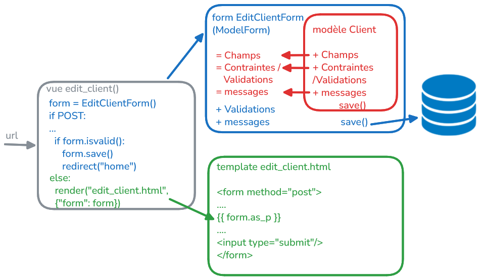

# générer un formulaire pour un flux de CUD (Create, Update, Delete) sur un modèle métier

## définition du flux: edit_client

* qu'est ce qu'on peut changer sur le client: email, mobile
* quelles sont les contraintes de validation: 
  - email, mobile doivent être non nul (required)
  - email doit matcher une regex de type email
* quels messages de succès et d'erreur à afficher dans le template
* comportement de la page en cas de succès: redirection vers la page d'accueil avec un message de succès
* messages d'erreur en cas de validation échouée: affichage des messages d'erreur dans le template

* structures html

```html
<!-- Header-->
        <header class="bg-dark py-5">
            <div class="container px-5">
                <div class="row gx-5 justify-content-center">
                    <div class="col-lg-6">
                        <div class="text-center my-5">
                            <h1 class="display-5 fw-bolder text-white mb-2">Edit Your Information</h1>
                            <p class="lead text-white-50 mb-4">Update your email address and mobile number.</p>
                        </div>
                    </div>
                </div>
            </div>
        </header>
```

```html
<!-- Edit form section -->
<section class="bg-light py-5">
    <div class="container px-5 my-5">
        <div class="row gx-5 justify-content-center">
            <div class="col-lg-6">
                <div class="card">
                    <div class="card-body p-5">
                       <form method="post">
                          <div class="d-grid">
                            <button class="btn btn-primary btn-lg" type="submit">Save Changes</button>
                          </div>
                       </form>

                    </div>
                </div>
                <div class="text-center mt-3">
                    back to home
                </div>
            </div>
        </div>
    </div>
</section>
```

## cration d'un formulaire simple avec ModelForm

* `./forms.py`: utilisation d'une sous classe Meta pour associer le modèle et les champs du formulaire à générer
* vue avec formulaire:
  - distinguer le traitement du formulaire **(POST)** et l'affichage du formulaire **(GET)**
  - traiter le forumlaire verifier l'adéquation des données POST avec les contraintes du modèle et les contraintes de validation du formulaire => `form.is_valid()`
  - utiliser `redirect(to=<url>)` pour redirection
* template avec formulaire:
  - forme simple `{{ form }}` moche
  - obligation d'ajout un token csrf pour sécuriser le formulaire: ``
  - bouton de validation dans `<form>`

```html
<form method="post">
...
<div class="d-grid">
   <button class="btn btn-primary btn-lg" type="submit">Save Changes</button>
</div>
</form>
```

* transition de lien: 
```html
<a class="text-decoration-none" href="">
  <i class="bi bi-vector-pen"></i>
</a>
```

## améliorations du formulaire

1. <ins>esthétique</ins>
  * `{{ form.as_p }}` pour afficher les champs du formulaire avec des balises `<p>
  * `{{ form.as_table }}` pour afficher les champs du formulaire avec des balises `<tr>`
  * `{{ form.as_ul }}` pour afficher les champs du formulaire avec des listes `<li>`

2. <ins>validation côté serveur</ins>
   * les champs des modèles contiennent des contraintes de validation **générale** 
     - `null=False` 
     - `blank=False` 
     - `unique=True` 
   
   *  des champs de modèles **particuliers**: EmailField, URLField *valide une regex*

   * on surcharger des méthodes de validation personnalisées pour un champs 
     - `clean_<fieldname>()`: qui doit valider `self.cleaned_data['<fieldname>']` et lever une exception `ValidationError` si la validation échoue

    * on peut également surcharger une méthode `clean()` pour valider des contraintes de validation **sur plusieurs champs à la fois** 
      - ex: *mdp et confirmation du mdp*" 
      - peut utilise des méthodes de validation de django comme `validate_slug`, `validate_odd`, etc.

3. <ins>messages Flash</ins>
   * messages flash pour afficher des messages *de succès ou d'erreur*
   * dans le template, ou en redirection
   * module `messages` dans la vue:
      - `messages.success(request, "message")` 
      - `messages.error(request, "message")`
   * dans le template:
     - `` ...

```html
<!-- home.html-->
<!-- Flash messages -->
        <div class="container px-5 mt-4">
            <div class="alert alert-danger alert-dismissible fade show" role="alert">
                <button type="button" class="btn-close" data-bs-dismiss="alert" aria-label="Close"></button>
            </div>
        </div>
```

```html
<div class="mb-4">
    <div class="alert alert-danger alert-dismissible fade show" role="alert">
        <button type="button" class="btn-close" data-bs-dismiss="alert" aria-label="Close"></button>
    </div>
</div>
```


4. <ins>squelette HTML personnalisé pour les champs/messages</ins>
   * on peut traiter les champs du formulaire individuellement via `{{ form.<fieldname> }}`
   * on peut traiter directement les erreurs du formulaire `{{ form.errors }}`
   * on peut traiter les messages d'erreur pour chaque champ individuellement via `{{ form.<fieldname>.errors }}`

```html
<div class="form-floating mb-3">
    <label for="">Email <span style="color: red">*</span></label>
    <div class="text-danger small mt-1"></div>
</div>
<div class="form-floating mb-3">
    <label for="">Mobile <span style="color: red">*</span></label>
    <div class="text-danger small mt-1"></div>
</div>
```



   
   
